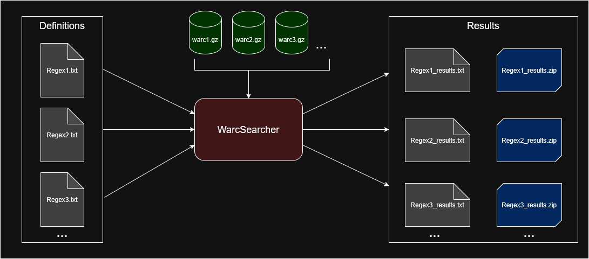

# WarcSearcher

A Python program that performs regular expression keyword searches over the contents of any number of local WARC.gz (Web Archive) files. [WARC specification](https://iipc.github.io/warc-specifications/specifications/warc-format/warc-1.1/)

WarcSearcher is designed to perform multiple simultaneous regex queries against records read from the WARC.gz files. These queries are supplied as "Definitions" - text files containing a regex to search with.

WarcSearcher will output the results in text format: one results file for each definition. Optionally, it can extract any record from the WARC.gz that yielded a match and saves the file to a zip archive.

## Features

* Searches all `response` records from any number of WARC.gz files against any number of regex definitions
* Multiprocessed regex searching and results output; User configurable
* Extracts files from any WARC.gz that produced a match to a .zip archive
* Optionally skips searching binary file data

## Setup

* Ensure Python is installed and download/clone the repository.
* Using a terminal, navigate to the repository and install all required libraries: `pip install -r requirements.txt`
* Configure `config.ini` at the root of the repository (see section below).
* Run `WarcSearcher.py` in the `source` folder.

## Configuration

WarcSearcher can be configured with the `config.ini` file at the root of the repository:

### Required Variables

* `WARC_GZ_ARCHIVES_DIRECTORY` - The directory containing the WARC.gz files. Subfolders will be searched recursively.
* `SEARCH_REGEX_DEFINITIONS_DIRECTORY` - The directory where the .txt files containing regular expressions to search with are located.
* `RESULTS_OUTPUT_DIRECTORY` - The directory where the results are output to. The .txt and .zip results files for the execution will be stored in a timestamped folder within this directory.

### Optional Variables

* `ZIP_FILES_WITH_MATCHES` - Default: `False`. When set to True, any WARC record that produced a match for a definition will be extracted from the WARC.gz file and saved to a zip archive, named similarly to the results text file.
* `MAX_CONCURRENT_SEARCH_PROCESSES` - Default: `4`. The number of concurrent processes to perform the regex searches with. These processes are independent of the main process responsible for reading the WARC records. Setting this higher may not necessarily perform the search faster - execution time is highly variable depending on the PC's number of logical processors, regexes used, and the size and quantity of the WARC.gz files to be searched. Reverts to maximum logical processors available on the PC if it exceeds that number.
* `MAX_RAM_USAGE_BYTES` - Default: `2000000000` (2GB). Target value in bytes for how much RAM is consumed by the WarcSearcher process. This is a failsafe to ensure that RAM is not exhausted if the search processes cannot keep up with the pace of WARC records being read in by the main process.
* `SEARCH_BINARY_FILES` - Default: `False`. Boolean indicating whether records containing non-human-readable binary file data (images, video, music, etc) should be searched. Setting this to `True` may greatly increase search time.
